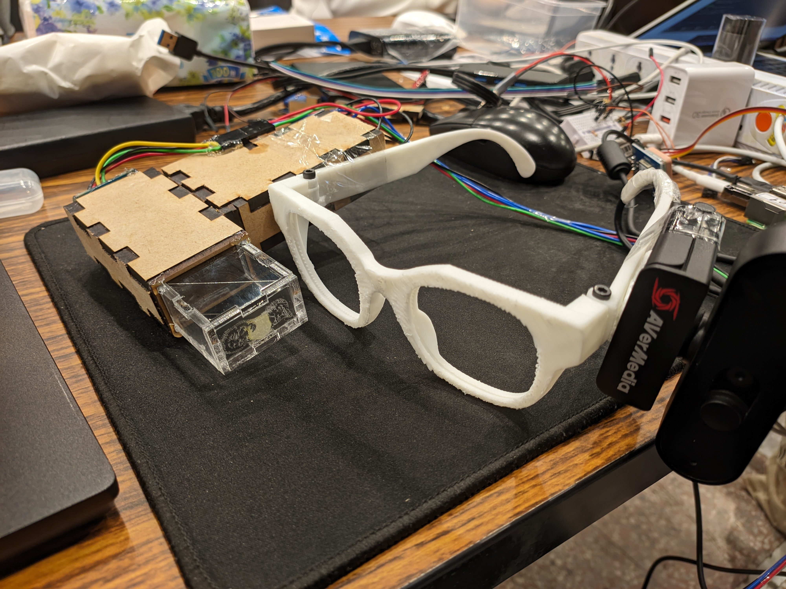

# VerySmartGlasses

[[Presentation]](demo/MakeNTU2024.pdf)

An attempt to a Very Smart Glasses at 2024 MakeNTU Explorer Hackathon

## Installation

> [!WARNING]  
> This project was intended to be ran on the Raspberry PI  
> touch.py - Raspberry PI fully working code  
> model.py - Windows partial working code  

Install the dependencies

```bash
pip install -r requirements.txt
```

Then run the script

```bash
python3 touch.py
```

## The thing

